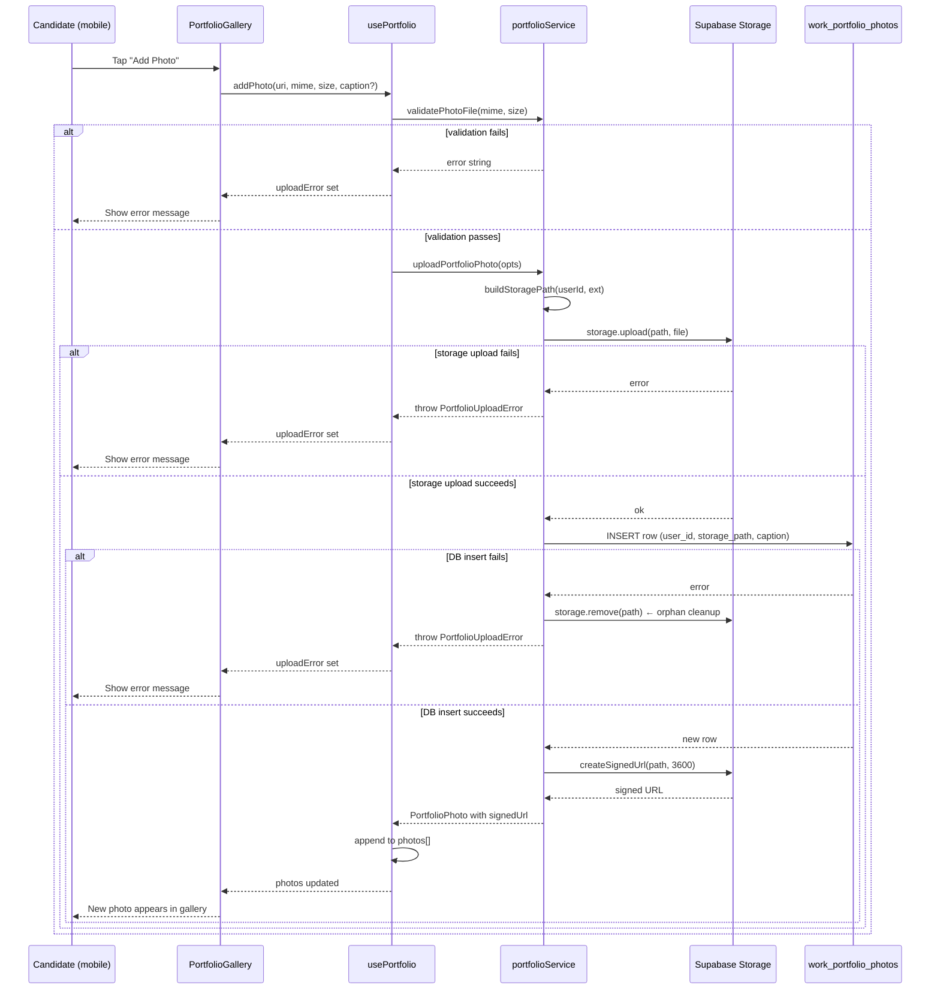

# Design Document — Work Portfolio Photos

## Overview

This feature adds a work portfolio photo capability to the AI SkillFit platform. Candidates upload photos of their past work directly from the mobile app's Profile page. Admins view those photos inside the Candidate Profile panel of the admin dashboard.

The implementation touches four layers:

1. **Supabase infrastructure** — a private storage bucket and a metadata table with RLS policies.
2. **Mobile app** — a new `portfolioService`, a `usePortfolio` hook, and a `PortfolioGallery` component embedded in the Profile screen.
3. **Admin dashboard** — a new `AdminPortfolioViewer` component embedded in the existing Candidate Profile panel.
4. **Shared concern** — signed URL generation with a 1-hour TTL, used by both clients.

The design deliberately keeps all Supabase calls inside dedicated service/hook layers so that UI components remain free of data-fetching logic, consistent with the existing codebase pattern (see `interviewService.ts`).

---

## Architecture

```mermaid
graph TD
    subgraph Mobile App (Expo / React Native)
        PS[ProfileScreen]
        PG[PortfolioGallery component]
        UP[usePortfolio hook]
        SVC[portfolioService.ts]
        PS --> PG
        PG --> UP
        UP --> SVC
    end

    subgraph Admin Dashboard (React + Vite)
        CP[CandidateProfilePanel]
        APV[AdminPortfolioViewer component]
        ASVC[adminPortfolioService.ts]
        CP --> APV
        APV --> ASVC
    end

    subgraph Supabase
        BUCKET[(work-portfolio-photos\nbucket — private)]
        TABLE[(work_portfolio_photos\ntable)]
        RLS{RLS Policies}
        TABLE --- RLS
        BUCKET --- RLS
    end

    SVC -->|storage.upload / createSignedUrl| BUCKET
    SVC -->|insert / select / delete| TABLE
    ASVC -->|select| TABLE
    ASVC -->|createSignedUrl| BUCKET
```

### Key design decisions

- **Private bucket + signed URLs** — files are never publicly accessible. Both clients call `storage.createSignedUrl()` with a 3600 s TTL before rendering an image. This satisfies Requirements 1.2 and 8.1–8.2.
- **Metadata table as source of truth** — the app never scans storage directly; it queries `work_portfolio_photos` and then resolves signed URLs for each row. This keeps listing fast and avoids storage list-API costs.
- **Orphan prevention via compensating delete** — if the DB insert fails after a successful storage upload, the service immediately calls `storage.remove()` on the just-uploaded path. This is the only place where a storage write and a DB write are coupled (Requirement 4.12).
- **Client-side validation before upload** — file size (≤ 10 MB) and MIME type (`image/jpeg`, `image/png`, `image/webp`) are validated in the service layer before any network call, giving instant feedback and avoiding wasted bandwidth (Requirements 4.4–4.6).
- **20-photo cap enforced in the service** — the hook checks the current count before opening the image picker (Requirements 4.13, 5.8).
- **Signed URL auto-refresh** — each client stores the URL generation timestamp alongside the URL. A `useEffect` / `useMemo` re-generates URLs when they are within 60 s of expiry, without requiring a page reload (Requirement 8.4).

---

## Components and Interfaces

### Mobile App

#### `portfolioService.ts`

Location: `frontend/src/services/portfolioService.ts`

```typescript
export interface PortfolioPhoto {
  id: string;
  user_id: string;
  storage_path: string;
  caption: string | null;
  uploaded_at: string;
  // resolved client-side, not stored in DB
  signedUrl?: string;
  signedUrlExpiresAt?: number; // Unix ms
}

export interface UploadPhotoOptions {
  userId: string;
  fileUri: string;
  mimeType: string;
  fileSize: number;
  caption?: string;
}

// Fetch all portfolio rows for a user and resolve signed URLs
export async function fetchPortfolioPhotos(userId: string): Promise<PortfolioPhoto[]>

// Validate, upload to storage, insert DB row. Returns the new PortfolioPhoto.
// Throws PortfolioUploadError on any failure; guarantees no orphaned storage files.
export async function uploadPortfolioPhoto(opts: UploadPhotoOptions): Promise<PortfolioPhoto>

// Delete storage file then DB row. Throws PortfolioDeleteError if storage delete fails
// (leaves state unchanged). Retries DB delete once if storage succeeds but DB fails.
export async function deletePortfolioPhoto(photo: PortfolioPhoto): Promise<void>

// Generate (or refresh) a signed URL for a single storage path.
export async function getSignedUrl(storagePath: string): Promise<{ url: string; expiresAt: number }>

// Validate file before upload. Returns null if valid, error message string if invalid.
export function validatePhotoFile(mimeType: string, fileSize: number): string | null

// Build the storage path for a new upload.
export function buildStoragePath(userId: string, extension: string): string
```

#### `usePortfolio` hook

Location: `frontend/src/hooks/usePortfolio.ts`

```typescript
export interface UsePortfolioResult {
  photos: PortfolioPhoto[];
  isLoading: boolean;
  isUploading: boolean;
  error: string | null;
  uploadError: string | null;
  addPhoto: (fileUri: string, mimeType: string, fileSize: number, caption?: string) => Promise<void>;
  removePhoto: (photo: PortfolioPhoto) => Promise<void>;
  refresh: () => Promise<void>;
  atLimit: boolean; // true when photos.length >= 20
}

export function usePortfolio(userId: string): UsePortfolioResult
```

The hook owns all state (`photos`, loading flags, errors). It calls `portfolioService` functions and updates local state optimistically on delete (removes from list immediately, rolls back on error).

#### `PortfolioGallery` component

Location: `frontend/src/components/PortfolioGallery.tsx`

Props:
```typescript
interface PortfolioGalleryProps {
  userId: string;
}
```

Renders:
- Section header "Work Portfolio"
- Horizontal `ScrollView` with `FlatList` of 100×100 pt thumbnails
- "Add Photo" button (disabled / hidden when `atLimit`)
- Empty-state placeholder when `photos.length === 0`
- Full-screen `Modal` for photo detail view with caption and Delete button
- Loading overlay during upload

The component uses `usePortfolio(userId)` for all data and actions.

---

### Admin Dashboard

#### `adminPortfolioService.ts`

Location: `frontend/dashboard/src/lib/adminPortfolioService.ts`

```typescript
export interface AdminPortfolioPhoto {
  id: string;
  storage_path: string;
  caption: string | null;
  uploaded_at: string;
  signedUrl: string | null;   // null if URL generation failed
  signedUrlExpiresAt: number; // Unix ms
}

// Fetch portfolio rows for a candidate and resolve signed URLs.
// Per-photo URL failures are caught; the photo is included with signedUrl = null.
export async function fetchCandidatePortfolio(candidateUserId: string): Promise<AdminPortfolioPhoto[]>
```

#### `AdminPortfolioViewer` component

Location: `frontend/dashboard/src/components/AdminPortfolioViewer.tsx`

Props:
```typescript
interface AdminPortfolioViewerProps {
  candidateUserId: string;
}
```

Renders:
- Section header "Work Portfolio"
- 2-column CSS grid of 80×80 px thumbnails
- Caption below each thumbnail
- Broken-image placeholder (`<ImageOff />` from lucide-react) when `signedUrl === null`
- Full-screen lightbox modal on thumbnail click
- Scoped error banner when the entire fetch fails (does not affect the rest of the Candidate Profile panel)
- Empty-state message when no photos exist

---

## Data Models

### `work_portfolio_photos` table

```sql
CREATE TABLE public.work_portfolio_photos (
  id           UUID        PRIMARY KEY DEFAULT gen_random_uuid(),
  user_id      UUID        NOT NULL
                           REFERENCES public.profiles(id)
                           ON DELETE CASCADE,
  storage_path TEXT        NOT NULL CHECK (char_length(storage_path) <= 500),
  caption      TEXT                 CHECK (caption IS NULL OR char_length(caption) <= 300),
  uploaded_at  TIMESTAMPTZ NOT NULL DEFAULT now()
);

CREATE INDEX idx_work_portfolio_photos_user_id
  ON public.work_portfolio_photos (user_id);
```

### Storage bucket

```sql
-- Run in Supabase SQL editor or via migration
INSERT INTO storage.buckets (id, name, public, file_size_limit, allowed_mime_types)
VALUES (
  'work-portfolio-photos',
  'work-portfolio-photos',
  false,                          -- private bucket
  10485760,                       -- 10 MB in bytes
  ARRAY['image/jpeg','image/png','image/webp']
);
```

### Storage path convention

```
{user_id}/{timestamp_ms}_{uuid_v4}.{ext}

Example:
  a1b2c3d4-e5f6-7890-abcd-ef1234567890/1720000000000_550e8400-e29b-41d4-a716-446655440000.jpg
```

`timestamp_ms` is `Date.now()` at upload time. `uuid_v4` is generated with `crypto.randomUUID()`. Together they guarantee uniqueness and prevent path collisions.

### RLS Policies

```sql
-- Enable RLS
ALTER TABLE public.work_portfolio_photos ENABLE ROW LEVEL SECURITY;

-- 1. Candidates read only their own rows; admins read all rows
CREATE POLICY "portfolio_select"
  ON public.work_portfolio_photos
  FOR SELECT
  USING (
    auth.uid() = user_id
    OR EXISTS (
      SELECT 1 FROM public.profiles
      WHERE id = auth.uid() AND role = 'admin'
    )
  );

-- 2. Any authenticated user may insert, but only for their own user_id
CREATE POLICY "portfolio_insert"
  ON public.work_portfolio_photos
  FOR INSERT
  WITH CHECK (auth.uid() = user_id);

-- 3. Any authenticated user may update only their own rows
CREATE POLICY "portfolio_update"
  ON public.work_portfolio_photos
  FOR UPDATE
  USING (auth.uid() = user_id)
  WITH CHECK (auth.uid() = user_id);

-- 4. Any authenticated user may delete only their own rows
CREATE POLICY "portfolio_delete"
  ON public.work_portfolio_photos
  FOR DELETE
  USING (auth.uid() = user_id);

-- Storage policies (applied via Supabase dashboard or SQL)

-- Candidates upload to their own prefix
CREATE POLICY "storage_candidate_insert"
  ON storage.objects
  FOR INSERT
  TO authenticated
  WITH CHECK (
    bucket_id = 'work-portfolio-photos'
    AND (storage.foldername(name))[1] = auth.uid()::text
    AND EXISTS (
      SELECT 1 FROM public.profiles
      WHERE id = auth.uid() AND role = 'candidate'
    )
  );

-- Candidates delete from their own prefix
CREATE POLICY "storage_candidate_delete"
  ON storage.objects
  FOR DELETE
  TO authenticated
  USING (
    bucket_id = 'work-portfolio-photos'
    AND (storage.foldername(name))[1] = auth.uid()::text
    AND EXISTS (
      SELECT 1 FROM public.profiles
      WHERE id = auth.uid() AND role = 'candidate'
    )
  );

-- Candidates read from their own prefix
CREATE POLICY "storage_candidate_select"
  ON storage.objects
  FOR SELECT
  TO authenticated
  USING (
    bucket_id = 'work-portfolio-photos'
    AND (storage.foldername(name))[1] = auth.uid()::text
    AND EXISTS (
      SELECT 1 FROM public.profiles
      WHERE id = auth.uid() AND role = 'candidate'
    )
  );

-- Admins read from any path
CREATE POLICY "storage_admin_select"
  ON storage.objects
  FOR SELECT
  TO authenticated
  USING (
    bucket_id = 'work-portfolio-photos'
    AND EXISTS (
      SELECT 1 FROM public.profiles
      WHERE id = auth.uid() AND role = 'admin'
    )
  );
```

---

## Data Flow Diagrams

### Upload Flow



### Delete Flow

```mermaid
sequenceDiagram
    participant U as Candidate (mobile)
    participant PG as PortfolioGallery
    participant Hook as usePortfolio
    participant SVC as portfolioService
    participant Storage as Supabase Storage
    participant DB as work_portfolio_photos

    U->>PG: Tap "Delete" in modal
    PG->>Hook: removePhoto(photo)
    Hook->>SVC: deletePortfolioPhoto(photo)
    SVC->>Storage: storage.remove(storage_path)
    alt storage delete fails
        Storage-->>SVC: error
        SVC-->>Hook: throw PortfolioDeleteError (storage)
        Hook-->>PG: error set (photo retained)
        PG-->>U: Show error message; photo stays visible
    else storage delete succeeds
        Storage-->>SVC: ok
        SVC->>DB: DELETE WHERE id = photo.id
        alt DB delete fails
            DB-->>SVC: error
            SVC->>DB: retry DELETE (once)
            alt retry succeeds
                DB-->>SVC: ok
                SVC-->>Hook: resolved
                Hook->>Hook: remove from photos[]
                Hook-->>PG: photos updated
                PG-->>U: Photo removed from gallery
            else retry fails
                DB-->>SVC: error
                SVC-->>Hook: throw PortfolioDeleteError (db)
                Hook-->>PG: error set
                PG-->>U: Show error message
            end
        else DB delete succeeds
            DB-->>SVC: ok
            SVC-->>Hook: resolved
            Hook->>Hook: remove from photos[]
            Hook-->>PG: photos updated
            PG-->>U: Photo removed from gallery
        end
    end
```

---

## Correctness Properties

*A property is a characteristic or behavior that should hold true across all valid executions of a system — essentially, a formal statement about what the system should do. Properties serve as the bridge between human-readable specifications and machine-verifiable correctness guarantees.*

### Property 1: Storage path format

*For any* user ID, the `buildStoragePath` function SHALL produce a path that matches the pattern `{userId}/{timestamp}_{uuid}.{ext}`, where `timestamp` is a positive integer, `uuid` is a valid UUID v4, and `ext` is the provided extension.

**Validates: Requirements 1.3, 4.7**

---

### Property 2: MIME type validation

*For any* MIME type string, `validatePhotoFile` SHALL return `null` (valid) if and only if the MIME type is exactly one of `image/jpeg`, `image/png`, or `image/webp`. For all other strings — including empty strings, partial matches, and case variants — it SHALL return a non-null error message.

**Validates: Requirements 1.5, 4.6**

---

### Property 3: File size validation

*For any* file size in bytes, `validatePhotoFile` SHALL return `null` (valid) if and only if the size is greater than 0 and less than or equal to 10,485,760 (10 MB). For any size exceeding 10 MB, it SHALL return a non-null error message.

**Validates: Requirements 1.4, 4.4, 4.5**

---

### Property 4: Upload–fetch round trip

*For any* valid upload (passing MIME and size validation), after `uploadPortfolioPhoto` completes successfully, calling `fetchPortfolioPhotos` for the same `userId` SHALL return a list that includes a row whose `storage_path` matches the path used during upload and whose `user_id` matches the uploading user.

**Validates: Requirements 4.8**

---

### Property 5: Orphan prevention on DB failure

*For any* upload where the storage write succeeds but the subsequent DB insert is mocked to fail, `uploadPortfolioPhoto` SHALL call `storage.remove()` on the uploaded path, leaving no file in the bucket after the error is thrown.

**Validates: Requirements 4.12**

---

### Property 6: Photo limit enforcement

*For any* user who already has exactly 20 photos in their portfolio, calling `addPhoto` SHALL reject the operation without opening the image picker and without making any storage or DB calls.

**Validates: Requirements 4.13, 5.8**

---

### Property 7: Delete atomicity — storage failure leaves state unchanged

*For any* photo, if `storage.remove()` is mocked to fail during `deletePortfolioPhoto`, the DB row SHALL remain present and the function SHALL throw without modifying the database.

**Validates: Requirements 5.7**

---

### Property 8: Caption round trip

*For any* caption string of length 1–300 characters, uploading a photo with that caption and then fetching the row SHALL return the same caption string unchanged.

**Validates: Requirements 6.2**

---

### Property 9: RLS — candidates see only their own rows

*For any* authenticated candidate user and any set of portfolio rows belonging to multiple users, a SELECT query executed under that candidate's JWT SHALL return only rows where `user_id` equals the candidate's `auth.uid()`.

**Validates: Requirements 3.2**

---

### Property 10: RLS — unauthenticated requests are rejected

*For any* operation (SELECT, INSERT, UPDATE, DELETE) on `work_portfolio_photos` attempted without a valid JWT, the Supabase client SHALL return an authorization error and SHALL NOT return or modify any data.

**Validates: Requirements 3.10**

---

### Property 11: Signed URL expiry

*For any* storage path, `getSignedUrl` SHALL return a URL whose `expiresAt` timestamp is approximately `Date.now() + 3600 * 1000` milliseconds (within a 5-second tolerance for execution time).

**Validates: Requirements 8.1, 8.2**

---

### Property 12: Partial URL failure resilience

*For any* list of N portfolio photos where a subset of M photos fail signed URL generation (mocked), `fetchPortfolioPhotos` / `fetchCandidatePortfolio` SHALL return all N photos, with `signedUrl = null` for the M failed ones and valid signed URLs for the remaining N − M photos.

**Validates: Requirements 7.8, 8.3**

---

## Error Handling

### Error taxonomy

| Error class | Trigger | User-facing message | System action |
|---|---|---|---|
| `PortfolioValidationError` | MIME type or file size invalid | "File type not supported" / "File is too large (max 10 MB)" | No network call made |
| `PortfolioUploadError` (storage) | `storage.upload()` returns error | "Upload failed. Please try again." | No DB insert attempted |
| `PortfolioUploadError` (db) | DB insert fails after storage success | "Upload failed. Please try again." | Compensating `storage.remove()` called |
| `PortfolioDeleteError` (storage) | `storage.remove()` returns error | "Could not delete photo. Please try again." | DB row untouched |
| `PortfolioDeleteError` (db) | DB delete fails after storage success | "Photo removed from storage but metadata could not be deleted. Please try again." | One automatic retry; error surfaced if retry fails |
| `PortfolioFetchError` | SELECT query fails | "Could not load portfolio photos." | Gallery shows error state; Profile page remains functional |
| `SignedUrlError` | `createSignedUrl()` fails for one photo | (silent — broken-image placeholder shown) | Other photos unaffected |

### Orphaned file prevention

The only scenario where a storage file could become orphaned is when the storage upload succeeds but the DB insert fails. The service handles this with a compensating delete:

```
try {
  await storage.upload(path, file)          // step 1
  await db.insert({ user_id, path, caption }) // step 2
} catch (dbError) {
  await storage.remove(path)                // compensating action
  throw new PortfolioUploadError(dbError)
}
```

If the compensating `storage.remove()` itself fails (e.g., network outage), the orphaned file will remain in storage. This is an acceptable edge case because:
- The file is in a private bucket and inaccessible without a signed URL.
- The DB row was never created, so the file will never be surfaced to any user.
- A periodic storage cleanup job (outside this feature's scope) can reconcile orphans by comparing storage paths against DB rows.

### Signed URL expiry handling

Both clients store `signedUrlExpiresAt` (Unix ms) alongside each photo. A `useEffect` (mobile) or `useMemo` (dashboard) checks whether any URL expires within the next 60 seconds and triggers a batch refresh via `createSignedUrl`. This avoids mid-session broken images without requiring a full page reload.

---

## Testing Strategy

### Unit tests

Unit tests cover pure functions and mocked service calls. They use Jest (mobile) and Vitest (dashboard).

**`portfolioService` unit tests:**
- `validatePhotoFile` — valid MIME types, invalid MIME types, boundary file sizes (0, 10 MB, 10 MB + 1 byte)
- `buildStoragePath` — output matches expected regex pattern
- `uploadPortfolioPhoto` with mocked Supabase client — success path, storage failure, DB failure (verify compensating delete called)
- `deletePortfolioPhoto` with mocked Supabase client — success path, storage failure (DB untouched), DB failure (retry called)
- `getSignedUrl` — returns URL with correct expiry window

**`usePortfolio` hook unit tests (React Native Testing Library):**
- Initial load — fetches photos, sets `isLoading` correctly
- `addPhoto` — calls service, appends to list on success, sets `uploadError` on failure
- `removePhoto` — optimistic removal, rollback on error
- `atLimit` — true when `photos.length >= 20`

**`AdminPortfolioViewer` unit tests (React Testing Library):**
- Renders empty state when no photos
- Renders grid with thumbnails when photos present
- Renders broken-image placeholder when `signedUrl === null`
- Scoped error banner does not unmount sibling components

### Property-based tests

Property-based tests use **fast-check** (available for both Jest and Vitest). Each test runs a minimum of **100 iterations**.

```
Tag format: Feature: work-portfolio-photos, Property {N}: {property_text}
```

**Property 1 — Storage path format**
```
// Feature: work-portfolio-photos, Property 1: buildStoragePath produces correct format
fc.assert(fc.property(
  fc.uuid(), fc.constantFrom('jpg', 'png', 'webp'),
  (userId, ext) => {
    const path = buildStoragePath(userId, ext);
    return /^[0-9a-f-]{36}\/\d+_[0-9a-f-]{36}\.(jpg|png|webp)$/.test(path);
  }
), { numRuns: 100 });
```

**Property 2 — MIME type validation**
```
// Feature: work-portfolio-photos, Property 2: MIME type validation
fc.assert(fc.property(
  fc.string(),
  (mime) => {
    const result = validatePhotoFile(mime, 1024);
    const allowed = ['image/jpeg', 'image/png', 'image/webp'];
    if (allowed.includes(mime)) return result === null;
    return result !== null;
  }
), { numRuns: 200 });
```

**Property 3 — File size validation**
```
// Feature: work-portfolio-photos, Property 3: file size validation
fc.assert(fc.property(
  fc.integer({ min: 0, max: 20_000_000 }),
  (size) => {
    const result = validatePhotoFile('image/jpeg', size);
    if (size > 0 && size <= 10_485_760) return result === null;
    return result !== null;
  }
), { numRuns: 200 });
```

**Property 5 — Orphan prevention on DB failure**
```
// Feature: work-portfolio-photos, Property 5: orphan prevention
fc.assert(fc.property(
  fc.record({ userId: fc.uuid(), ext: fc.constantFrom('jpg', 'png', 'webp') }),
  async ({ userId, ext }) => {
    const mockStorage = { upload: jest.fn().mockResolvedValue({ data: {}, error: null }),
                          remove: jest.fn().mockResolvedValue({ error: null }) };
    const mockDb = { insert: jest.fn().mockResolvedValue({ error: { message: 'DB error' } }) };
    await expect(uploadPortfolioPhoto({ userId, ..., mockStorage, mockDb })).rejects.toThrow();
    expect(mockStorage.remove).toHaveBeenCalledTimes(1);
  }
), { numRuns: 100 });
```

**Property 8 — Caption round trip**
```
// Feature: work-portfolio-photos, Property 8: caption round trip
fc.assert(fc.property(
  fc.string({ minLength: 1, maxLength: 300 }),
  async (caption) => {
    const photo = await uploadPortfolioPhoto({ ..., caption });
    expect(photo.caption).toBe(caption);
  }
), { numRuns: 100 });
```

**Property 11 — Signed URL expiry**
```
// Feature: work-portfolio-photos, Property 11: signed URL expiry
fc.assert(fc.property(
  fc.uuid(),
  async (storagePath) => {
    const before = Date.now();
    const { expiresAt } = await getSignedUrl(storagePath);
    const after = Date.now();
    const expectedMin = before + 3600 * 1000 - 5000;
    const expectedMax = after + 3600 * 1000 + 5000;
    return expiresAt >= expectedMin && expiresAt <= expectedMax;
  }
), { numRuns: 100 });
```

**Property 12 — Partial URL failure resilience**
```
// Feature: work-portfolio-photos, Property 12: partial URL failure resilience
fc.assert(fc.property(
  fc.array(fc.record({ id: fc.uuid(), storage_path: fc.string() }), { minLength: 1, maxLength: 10 }),
  fc.integer({ min: 0 }),
  async (photos, failCount) => {
    const actualFail = Math.min(failCount, photos.length);
    // mock first `actualFail` URLs to fail
    const result = await fetchCandidatePortfolio(candidateId, { mockPhotos: photos, failFirst: actualFail });
    expect(result).toHaveLength(photos.length);
    const failed = result.filter(p => p.signedUrl === null);
    expect(failed).toHaveLength(actualFail);
  }
), { numRuns: 100 });
```

### Integration tests

Integration tests run against a local Supabase instance (via `supabase start`) or a dedicated test project.

- **RLS — candidate isolation**: Create two candidate users, insert photos for each, verify each user's SELECT returns only their own rows.
- **RLS — admin reads all**: Create admin user, verify SELECT returns rows for all candidates.
- **RLS — unauthenticated rejected**: Call SELECT/INSERT/DELETE without a JWT, verify 401/403 response.
- **Storage policy — cross-user upload rejected**: Attempt to upload to another user's path prefix, verify rejection.
- **ON DELETE CASCADE**: Insert profile + photos, delete profile, verify portfolio rows are gone.
- **Signed URL auto-refresh**: Generate URL, advance mock clock past expiry, verify component triggers refresh.
- **Bucket configuration**: Verify `is_public = false`, `file_size_limit = 10485760`, `allowed_mime_types` correct.
